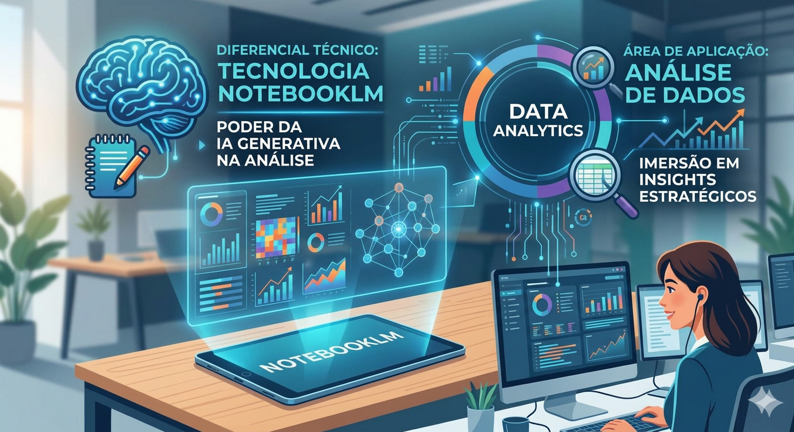

# 🧠 Desafio 01: Imersão em IA Generativa com NotebookLM

  

> **Descrição:** Desenvolvimento de um manual didático e abrangente sobre Inteligência Artificial, focado em simplificar a jornada de iniciantes no universo da IA Generativa aplicada a dados.

---

## 📌 Sumário
1. [Sobre o Projeto](#-sobre-o-projeto)
2. [Objetivos do Manual](#-objetivos-do-manual)
3. [Base de Conhecimento (Fontes)](#-base-de-conhecimento-fontes)
4. [Metodologia de Estudo](#-metodologia-de-estudo)
5. [Principais Insights](#-principais-insights)
6. [Como Utilizar este Repositório](#-como-utilizar-este-repositório)
7. [Autor](#-autor)

---

## 📖 Sobre o Projeto

Este repositório é o resultado de uma imersão profunda na interseção entre **IA Generativa** e **Análise de Dados**. Utilizando o potencial do **Google NotebookLM**, processei documentos governamentais, acadêmicos e técnicos para criar um manual que traduz a complexidade da IA para uma linguagem acessível e estratégica.

O projeto não apenas sintetiza informações, mas estrutura um caminho de aprendizado para quem deseja expandir habilidades em uma das áreas mais crescentes da tecnologia atual.

## 🎯 Objetivos do Manual

*   **Aceleração de Curva de Aprendizado:** Facilitar o entendimento de termos técnicos (LLMs, RAG, Tokens) para leigos.
*   **Soberania Digital:** Basear o conhecimento em planos nacionais (PBIA 2025) e diretrizes éticas.
*   **Aplicação Prática:** Mostrar como a IA pode ser usada para extrair insights valiosos de grandes volumes de dados.

## 📚 Base de Conhecimento (Fontes)

A curadoria deste manual foi baseada em fontes de alto rigor técnico e institucional:

| Fonte | Instituição | Tipo de Documento |
| :--- | :--- | :--- |
| [IA em Data Analytics](https://cloud.google.com/use-cases/ai-data-analytics?hl=pt-BR) | Google Cloud | Guia de Caso de Uso |
| [PBIA 2025](https://www.gov.br/mcti/pt-br/centrais-de-conteudo/publicacoes-mcti/plano-brasileiro-de-inteligencia-artificial/pbia_mcti_2025.pdf) | MCTI | Plano Nacional |
| [Aplicação de IA](https://repositorio-api.animaeducacao.com.br/server/api/core/bitstreams/5d8f1cbd-0a29-440b-9a67-a13a58ece747/content) | Anima | E-book |
| [Ferramentas e Desafios](https://adapta.org/blog/ia-para-analise-de-dados) | ADAPTA | Guia |

## 🛠️ Metodologia de Estudo

1.  **Ingestão de Dados:** Carregamento das fontes citadas no motor do NotebookLM.
2.  **Processamento Semântico:** Cruzamento de dados entre o Plano Brasileiro (PBIA) e aplicações práticas do Google Cloud.
3.  **Refinamento de Prompts:** Utilização de técnicas de *Prompt Engineering* para extrair resumos didáticos e guias de "passo a passo".
4.  **Estruturação de Manual:** Organização do output em um guia lógico de introdução, desenvolvimento e conclusão.

------------------------------
## 🧠 Engenharia de Prompts 

Engenharia de Prompts e "Cicatrizes": Do Ruído à Alavancagem
Este exemplo demonstra a transição do "mecânico de dados" para o analista aumentado, focando em eficiência arquitetônica e redução do token burn.

Iteração	Prompt Executado	Resultado Técnico (Baseado no Texto)	Impacto Estratégico

| Iteração | Prompt executado | Resultado Técinico |
| :--- | :--- | :--- |
|Prompt 1 (Ruim)	| "Resuma o impacto da IA nos dados."	| Genérico: Resumo superficial sobre automação, ignorando o volume de 181 zettabytes e a soberania tecnológica.	|
|Prompt 2 (Ajustado)	| "Atue como um Estrategista de Dados GenAI. Resuma o ciclo de vida moderno em 5 tópicos, focando na decisão entre RAG e Fine-tuning para gerenciar custos."	| Preciso: O modelo detalhou a latência e a fundamentação em fatos para reduzir alucinações, focando em eficiência arquitetônica.	| 

## 🩹 Minhas "Cicatrizes" (Troubleshooting)
Durante o desenvolvimento, enfrentei dois desafios principais:

   Alucinação Contextual: Ao perguntar sobre o Plano Brasileiro de IA (PBIA), a IA misturou dados de planos antigos. Solução: "Ancorei" o prompt exigindo que ela citasse especificamente o valor de R$ 23,03 bilhões presente no texto fonte.

------------------------------
## 4. Miniguia de Estudo: O Futuro da Análise 📖
🔗 Acesso ao Projeto
Você pode visualizar o projeto completo e interagir com as fontes diretamente através do link abaixo:

> [**Acessar NotebookLM - Manual de IA**](https://notebooklm.google.com/notebook/afc79a06-9278-4f8f-8e5c-eef795755335)

📌 Resumo Executivo
As fontes exploram como a Inteligência Artificial (IA) generativa e a análise de dados estão transformando radicalmente o ambiente corporativo e a produtividade. O conteúdo detalha a evolução do analista de dados, que deixa de realizar tarefas manuais de limpeza para atuar como um condutor estratégico de inteligência aumentada. Os textos destacam o surgimento da análise conversacional, onde o uso da linguagem natural permite que colaboradores sem perfil técnico obtenham insights complexos de forma instantânea. Além dos ganhos em eficiência e inovação, os documentos enfatizam a necessidade de governança ética, segurança e proteção de dados sensíveis para garantir a confiabilidade dos sistemas

## 📚 Glossário Técnico: Revolução da Inteligência de Dados
Tabela consolidada de termos fundamentais para a era da **IA Generativa**, **Soberania Tecnológica** e **Ciclo de Vida Estratégico**.

| Categoria | Termo | Definição Técnica e Estratégica |
| :--- | :--- | :--- |
| **Fundamentos** | **Inteligência Artificial (IA)** | Modelos e técnicas para previsões e decisões; hoje a camada fundamental da infraestrutura corporativa moderna. |
| **Fundamentos** | **Algoritmo** | Conjunto de regras precisas que transformam dados de entrada em saídas específicas através de etapas finitas. |
| **Fundamentos** | **Ciência de Dados** | Metodologias e algoritmos usados para extrair conhecimento e apoiar a tomada de decisão estratégica. |
| **Fundamentos** | **Big Data** | Dados massivos (volume/variedade/velocidade) que exigem arquiteturas escaláveis para processamento (ex: 181 zettabytes). |
| **Fundamentos** | **Viés (Bias)** | Erro sistemático que distorce resultados; combatê-lo é parte vital da **Auditoria Ética** e Governança. |
| **Machine Learning** | **Machine Learning** | Subárea da IA focada em sistemas que aprendem com dados sem serem explicitamente programados para cada tarefa. |
| **Machine Learning** | **Aprendizado Supervisionado** | O modelo é treinado com dados "rotulados", onde as respostas corretas já são conhecidas pelo sistema. |
| **Machine Learning** | **Não Supervisionado** | O sistema aprende com dados sem rótulos, buscando descobrir padrões, grupos ou anomalias por conta própria. |
| **Machine Learning** | **Deep Learning** | Aprendizado profundo baseado em redes neurais artificiais organizadas em múltiplas camadas de processamento. |
| **Machine Learning** | **LLM (Large Language Models)** | Modelos treinados com volumes massivos (ex: Gemini/GPT) para processar e gerar linguagem humana sofisticada. |
| **Métodos Analíticos** | **Análise Preditiva** | Uso de dados históricos para construir modelos capazes de prever tendências ou resultados futuros. |
| **Métodos Analíticos** | **Análise Prescritiva** | Nível avançado que recomenda ações concretas para atingir um objetivo desejado, acelerando decisões no C-suite. |
| **Métodos Analíticos** | **Inferência** | O ato de aplicar um modelo já treinado a um novo dado para gerar um resultado imediato (classificação ou previsão). |
| **Métodos Analíticos** | **Clustering (Agrupamento)** | Técnica para dividir dados em grupos baseada em suas similaridades semânticas ou estatísticas. |
| **Estratégia & Ops** | **RAG (Retrieval-Augmented)** | "Padrão ouro" para recuperar informações de bases proprietárias em tempo real, reduzindo alucinações e custos. |
| **Estratégia & Ops** | **Fine-tuning (Ajuste Fino)** | Ajuste de parâmetros de um modelo pré-treinado para adaptá-lo a um tom de voz ou terminologia técnica específica. |
| **Estratégia & Ops** | **MLOps** | Práticas para gerenciar o ciclo de vida do modelo, garantindo segurança, confiabilidade e controle de "token burn". |
| **Estratégia & Ops** | **Dados Sintéticos** | Dados criados artificialmente (mimetismo) para testes sem expor PII, garantindo a soberania e privacidade (LGPD). |

## 🚀 Prompts Reutilizáveis para Analistas

* "Como a IA generativa transforma o papel do analista de dados?"
* "Quais são os principais desafios éticos e de privacidade em 2026?"
* "Como a inteligência artificial ajuda na tomada de decisões estratégicas?"

## 👤 Autor

Desenvolvido por **Michael Pires** – Sinta-se à vontade para se conectar!

